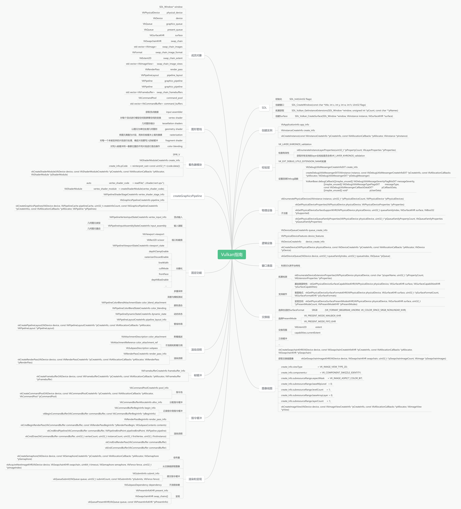

## Preface

This is a personal study project based on the VulkanTutorial, where I have restructured and optimized some of the project. Additionally, I have replaced GLFW with SDL2 for window management.

Vulkan-Tutorial: https://vulkan-tutorial.com/  
Code reference: https://github.com/Overv/VulkanTutorial

